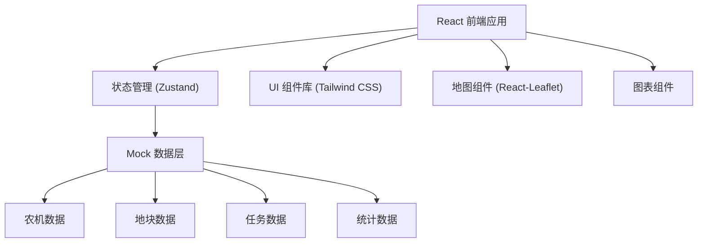
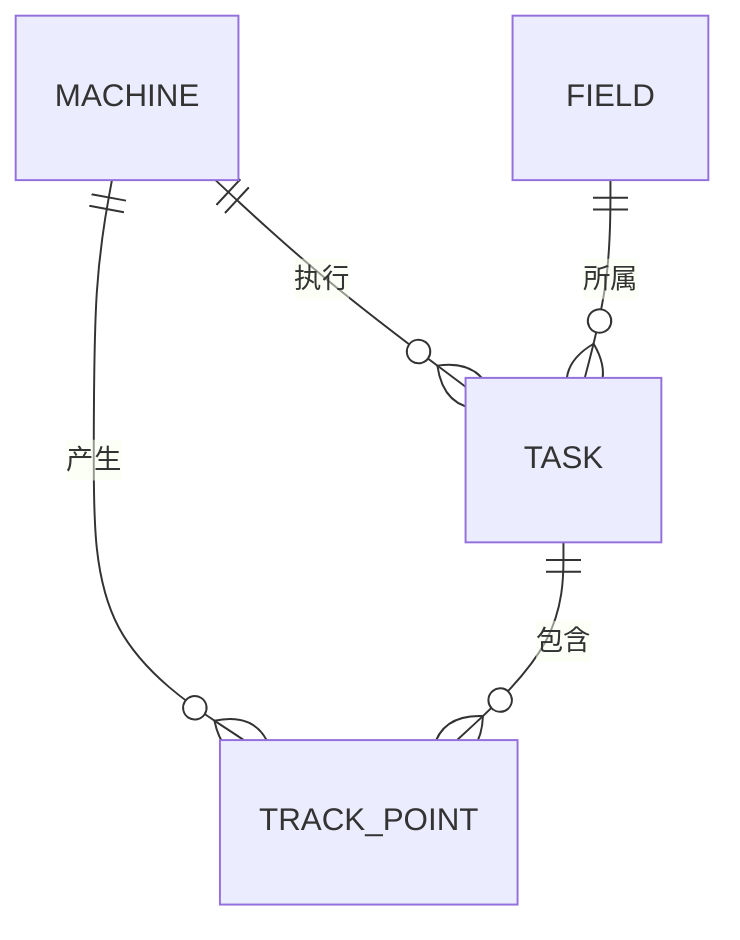

## 1. 架构设计



## 2. 技术描述

- **前端框架**：React@18 + TypeScript
- **构建工具**：Vite
- **样式方案**：Tailwind CSS@3
- **状态管理**：Zustand
- **路由管理**：React Router DOM
- **地图库**：Leaflet + react-leaflet
- **图标库**：Lucide React
- **数据**：前端 Mock 数据，模拟实时更新

## 3. 目录结构

```
src/
├── components/          # 通用组件
│   ├── Layout/         # 布局组件
│   ├── Map/            # 地图相关组件
│   ├── Machine/        # 农机相关组件
│   ├── Task/           # 任务相关组件
│   └── Stats/          # 统计相关组件
├── pages/              # 页面组件
│   ├── Dashboard.tsx   # 调度主面板
│   ├── Tasks.tsx       # 任务管理页
│   └── Statistics.tsx  # 统计分析页
├── store/              # 状态管理
│   └── useStore.ts
├── data/               # Mock 数据
│   ├── machines.ts
│   ├── fields.ts
│   ├── tasks.ts
│   └── statistics.ts
├── types/              # TypeScript 类型定义
│   └── index.ts
├── utils/              # 工具函数
│   ├── geo.ts
│   └── format.ts
├── App.tsx
├── main.tsx
└── index.css
```

## 4. 路由定义

| 路由 | 页面 | 说明 |
|------|------|------|
| / | 调度主面板 | 地图 + 农机列表 + 快捷操作 |
| /tasks | 任务管理 | 任务列表 + 创建任务 |
| /statistics | 统计分析 | 作业面积、油耗等数据图表 |

## 5. 数据模型

### 5.1 实体关系



### 5.2 数据类型定义

```typescript
// 农机类型
type MachineType = 'harvester' | 'seeder' | 'drone' | 'tractor';
// 农机状态
type MachineStatus = 'working' | 'idle' | 'maintenance' | 'transfer';
// 作业类型
type WorkType = 'plowing' | 'seeding' | 'management' | 'harvesting';

interface Machine {
  id: string;
  name: string;
  type: MachineType;
  status: MachineStatus;
  position: [number, number]; // [lat, lng]
  heading: number; // 方向角度
  driver: string;
  speed: number;
  fuelLevel: number;
  todayArea: number;
  todayFuel: number;
}

interface Field {
  id: string;
  name: string;
  area: number; // 亩
  coordinates: [number, number][]; // 多边形顶点
  cropType: string;
  workType?: WorkType;
}

interface Task {
  id: string;
  fieldId: string;
  machineId: string;
  workType: WorkType;
  status: 'pending' | 'assigned' | 'accepted' | 'working' | 'completed';
  scheduledTime: string;
  startTime?: string;
  endTime?: string;
  area?: number;
  fuelUsed?: number;
}

interface TrackPoint {
  machineId: string;
  timestamp: number;
  position: [number, number];
  speed: number;
  fuel: number;
}

interface DailyStats {
  date: string;
  machineId: string;
  totalArea: number;
  totalFuel: number;
  workHours: number;
}
```

### 5.3 Mock 数据规划

- 农机数据：8-12 台，涵盖收割机、播种机、无人机、拖拉机
- 地块数据：5-8 个地块，多边形坐标
- 任务数据：历史任务 + 进行中任务 + 待分配任务
- 轨迹数据：模拟轨迹点，支持回放

## 6. 核心功能实现方案

### 6.1 地图可视化
- 使用 react-leaflet 封装 Leaflet 地图
- 自定义 DivIcon 实现农机状态图标
- 地块使用 Polygon 组件渲染
- 轨迹使用 Polyline 组件，带渐变效果

### 6.2 智能派单算法
- 计算目标地块中心与各空闲农机的距离
- 筛选同类型作业的可用农机
- 按距离排序，推荐最近的 3 台农机

### 6.3 实时数据模拟
- 使用 setInterval 模拟 GPS 位置更新
- 作业中农机沿轨迹移动，更新位置和状态
- 随机波动油耗和作业面积

### 6.4 轨迹回放
- 预先生成轨迹点数组
- 使用 requestAnimationFrame 逐帧播放
- 支持播放/暂停/倍速/进度拖动
